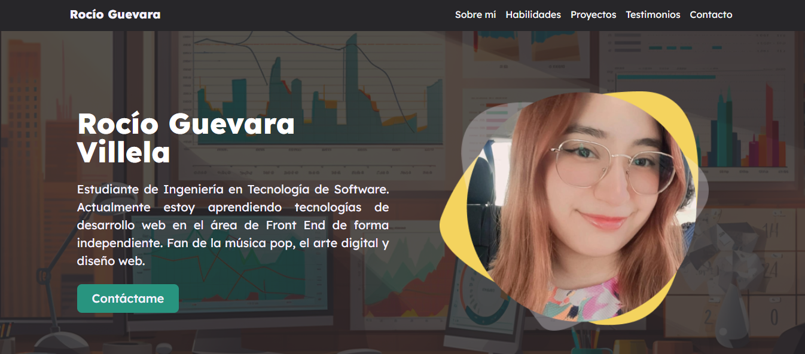
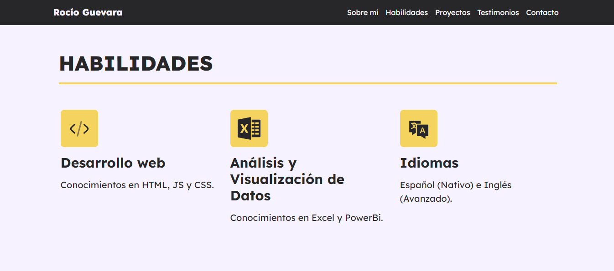
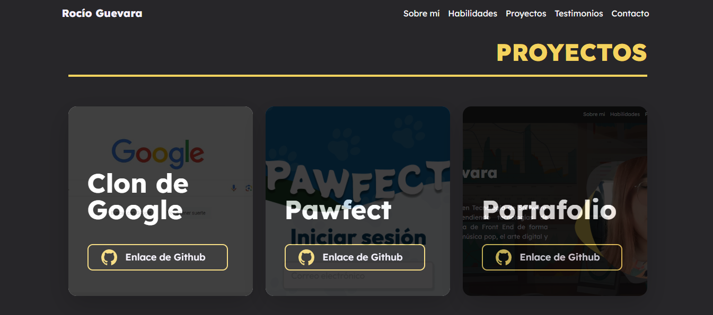
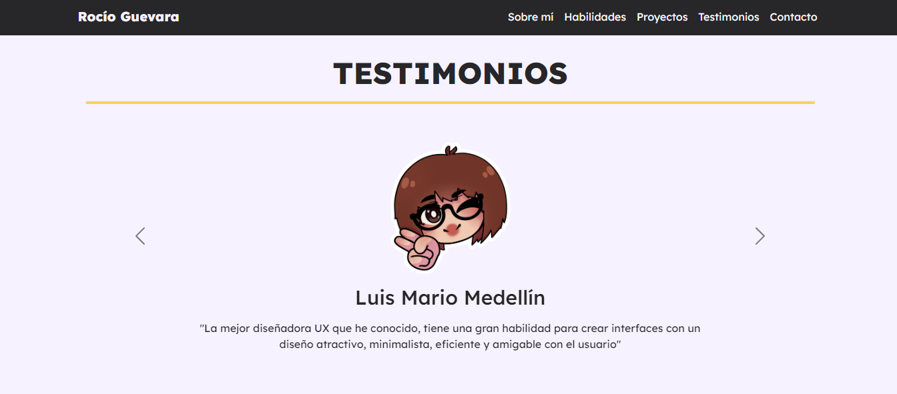
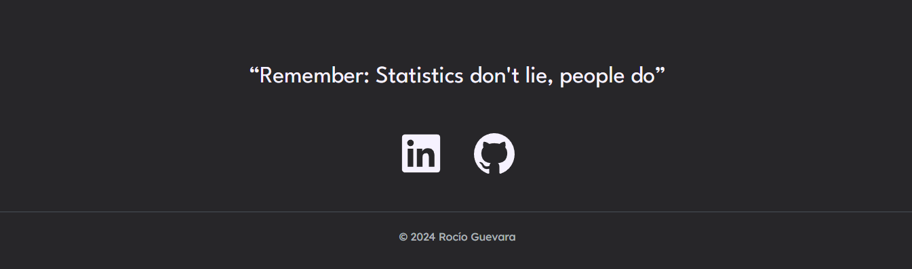

# Mi portafolio de habilidades TECNOLOCHICAS PRO

El presente proyecto es un portafolio desarrollado para poner en práctica las habilidades obtenidas dentro del bootcamp de Desarrollo Front-End de Tecnolochicas PRO.

Fue desarrolllado con HTML, CSS y JS con el uso del framework de UI Bootstrap, utilizando además bibliotecas externas.

La página es responsiva (adaptable a diferentes tamaños de pantalla <!-- dispositivos -->) e incluye la presentación de la autora del proyecto.

[Proyecto Desplegado: https://roguvi.netlify.app/](https://roguvi.netlify.app/)

## Secciones de mi sitio

## Tecnología
* HTML
* CSS
* Bootstrap
* JavaScript

---
Desarrollado por [Rocío Guevara](https://github.com/RocioGV) en [Tecnolochicas PRO](https://tecnolochicas.mx/).